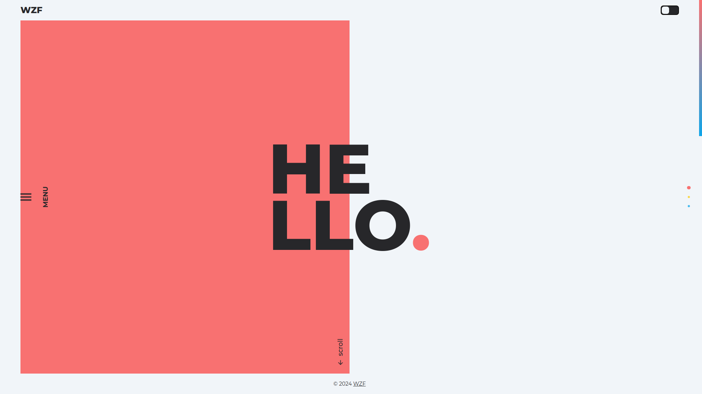
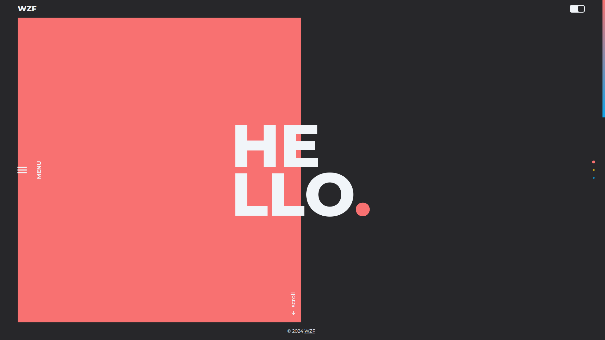

# Portfolio

### [Live Demo](https://woonzf.github.io/portfolio/)

### About:

Hello, this is my first and current portfolio.

It was created as the final project: [Homepage](https://www.theodinproject.com/lessons/node-path-advanced-html-and-css-homepage) of The Odin Project's Advanced HTML and CSS Course.

I did not follow the template provided and try to make it more stylish. It is actually the second iteration as I am not satisfied with the [first one](https://github.com/woonzf/odin-homepage). In my opinion, the first one has better mobile view and this one has better desktop view.

Design inspired by [Wokine](https://www.awwwards.com/sites/wokine).

### Features:

- Interactive
- Responsive Design
- Dark Mode

### Screenshots

### Languages:

- HTML
- CSS
- JavaScript

### Frameworks:

- Tailwind CSS
- Prettier

### Module bundler:

- Webpack

### Resources:

- [Montserrat font](https://fonts.google.com/specimen/Montserrat)
- [GitHub logo](https://github.com/logos)
- [Icons](https://pictogrammers.com/library/mdi/)
- [Profile Picture](https://www.pexels.com/photo/man-sitting-on-bench-1666779/)

### Possible Improvements:

- Animation for each section as they are scrolled into view
